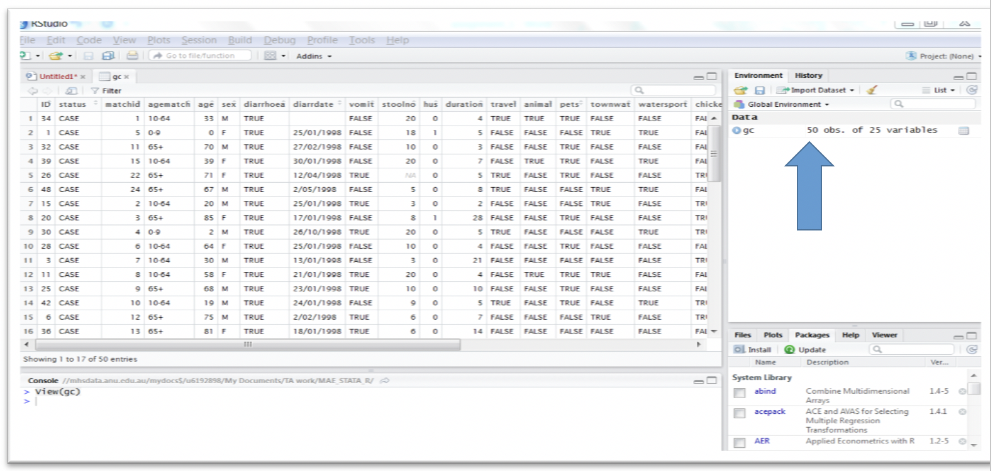
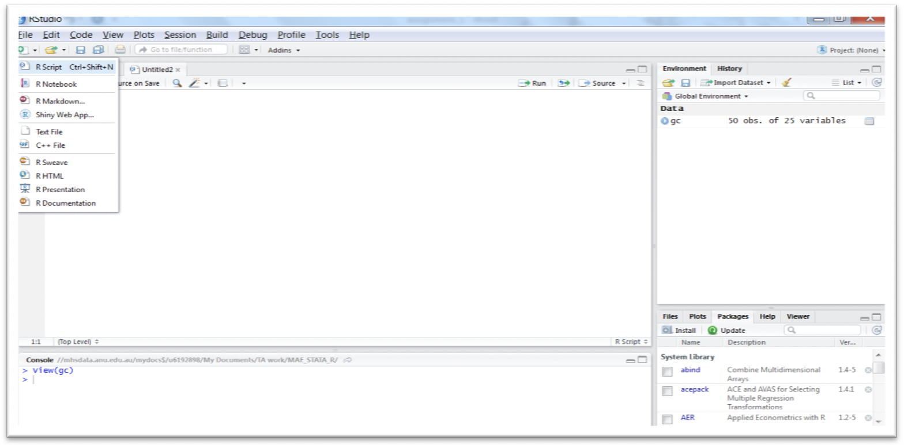
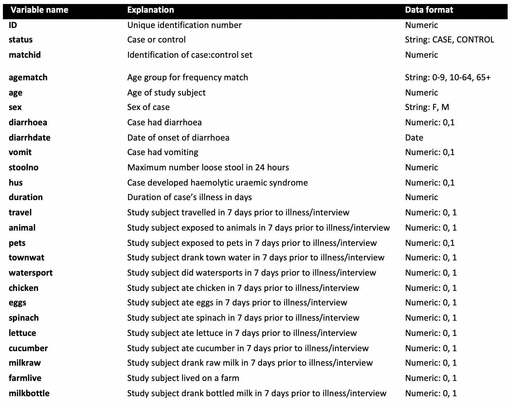

```{r setup, include=FALSE}
knitr::opts_chunk$set(echo = TRUE)
```

***

### Learning objectives:

By the end of this session participants will have the skills and ability to:

+ Perform descriptive analysis on case control data using R 
+ Calculate odds ratios and attributable risks for case control study data using R
+ Discuss the difference between frequency and individual matching in case control studies
+ Conduct an analysis of matched case control study data using R
+ Interpret results of simple case control analysis
+ Conduct a conditional logistic regression analysis of matched case control study data using R

***


This data analysis exercise was designed by Martyn Kirk MAppEpid PhD, National Centre for Epidemiology and Population Health in August 2013 and was last reviewed in September 2017. This case study on introductory analysis of case control study data requires use of the following dataset:

+ greencountry.csv


This practical exercise is based on chapters and examples from the following textbooks:


*Jewell N. Statistics for Epidemiology. 2004. Chapman & Hall/CRC, New York.*

*Schlesselman JJ. Case-Control Studies Design, Conduct, Analysis. 1982. Oxford University Press, New York.*

*Hosmer DW & Lemeshow S. Applied Logistic Regression. Third Edition. 2013 John Wiley and Sons, New York.*


#### An Introduction to R 

R packages are bundles of functions which extend the capabilities of R. Thousands of add-on packages are available in the main online repository (CRAN) and several more packages can be found on GitHub. These packages can be found and installed online. 

We will mainly use packages which are already installed in R. Add-on packages sometimes help make things easier. In such cases, we will install the add-on packages.  Run the following code at the start to ensure that you have all the available packages and functions you need for analysis:

`install.packages (“package_name1”, “package_name2”)`

And to to load an installed package: 

`library(“package name”)`

R and STATA have minor difference in default setting and methods. In this document, we will follow the STATA analysis as closely as possible, but small and usually important difference in R and STATA will be noted. Unlike STATA, R can hold multiple datasets in memory simultaneously and so, there is no need to save intermediate files or close and re-open datasets. 


####  Introduction to Study 

Good case control studies usually have study hypotheses that focus specifically on one or more exposures that are causally related to a given disease. Epidemiologists collect data relating the disease to the exposures, along with information on potential confounders. The key distinguishing feature of case control studies is that both cases and controls are selected into the study according to well-defined criteria on the basis of whether they have disease or not. Investigators often incorporate individual or frequency matching of cases and controls in study design to ensure statistical efficiency and to control potential confounding.

Prior to descriptive analysis of any case control study dataset, it is important for analysts to check coding of all variables and recode data. The second step is a thorough review of all variables to examine the data. For case control studies specifically, we are interested in ensuring that cases and controls are similar in terms of demographic variables and other factors that are not thought to be related to disease. This may include a comparison of matching variables to ensure that study recruitment has worked to plan. We would then conduct simple cross tabulations and stratified analyses, before moving onto more sophisticated multivariable analysis—according to a predetermined data analysis plan of course!

In this exercise we will use a case control for an outbreak of Shiga toxin producing E. coli infection to conduct a simple descriptive analysis, and estimate measures of association. The study will allow us to interpret findings of a case control study that employs frequency matching of controls. We will also analyze the data employing pair matching of cases and controls. 


#### 1. Introduction to the R Studio environment 

Setting your working directory

Just as in STATA, you can set a folder to be your working directory. This is done using the `setwd` command (set working directory), e.g. `setwd("C:/Users/Documents/myexample")`. Ideally however, create a new project, which will create a project file on your computer. Move all of your data files for the session into this project folder. This project folder will become your working directory. 


##### Reading your datasets. 
 
*To import data from a csv file:*
This can be done by saving your excel or STATA file as a csv file and importing in directly into R. 

```{r}
#to import a csv file
#Select separator as comma (sep = “,”)
#Do not import “string”variables as “Factors” (stringsAsFactors = FALSE)
#greencountry.csv is read and saved in R as gc
gc <- read.csv("greencountry.csv", sep = "," ,stringsAsFactors    = FALSE)

```


##### Browsing your data

R Studio has a nice feature where everything is in one browser window, so you can browse your dataset and your code without having to switch between windows. 

```{r}
#to view your dataset 
View(gc)
```

Alternatively, you can also view your dataset by clicking on “gc” in on the top right panel in R studio browser (see Fig 1)


*Figure 1: Browsing your data in R studio*
```{r, fig.align='center', out.width = "850px", echo=FALSE}

```

##### Saving your codes in R Scripts 

This is the equivalent of creating a “do-file” in STATA. You can save your comments here using “#”. Your codes are saved in the R-Scripts (See Fig 2)


*Figure 2: Creating a new R-Script in R studio*
```{r, fig.align='center', out.width = "850px", echo=FALSE}

```


#### 2. Checking Your Data 

##### 2.1 About the study

Greencountry is a case control study of an outbreak of Shiga toxin producing E. coli (STEC) that occurred in the Tasmanian town of Greencountry (population 5,500 persons) in the first six months of 1998. Investigators were concerned about exposures in the farm environment, as Greencountry was a rural area and several cases lived on a farm. To identify potential sources of infection, the Tasmanian Department of Health conducted a case control study of 25 cases and 25 controls. Controls were selected from the same medical practice as cases and were matched to a case by age (±5 years). 

    Why use a case control study in this instance? What are some of the benefits and challenges in doing so?

Initially, we are going to conduct simple univariate analyses. Then we will analyze the dataset using frequency matching in three age groups: 0-9 years, 10-64 years and 65 years and above. Finally, we will show you how to analyze the data using pairwise (i.e. individual) matching. The aim of this analysis of data from the case control study is to identify possible causes of STEC infection.

**Task 1: You have been asked to analyze the case control study data by your new boss—Dr Robert Hogspen, Director of the Greencountry Council.**


The first thing you do is:

* Create our R-Script and write comments and name it

* Open your dataset “greencountry.csv”

* Inspect the dataset using commands, such as: summary and describe. 

* You can also review the dataset in browse. The dataset isn’t particularly wide with only 24 variables. A convenient way to examine the data is to use the `table` and `summary` command that allows you to prepare frequencies of variables. The command `table` will give you a very basic frequency table. The command `summary` will give you a more detailed summary as in STATA. 

Below you will see the data dictionary for “greencountry.csv”. There is clearly a need for some recoding and cleaning of these data. 

    Question 1. Discuss what changes you need to make to get data ready for your analysis. Write down which variables need to be recoded.
    

The following changes need to be made to the data:

1. status needs changing to a numeric variable: 0 control and 1 case
2. agematch needs changing to a numeric variable containing 3 levels
3. sex needs changing to a numeric variable: 0 female and 1 male and
4. Exposure variables all need a label.

We will use the assignment operator `<-` to create a new variable. R's ability to handle variable labels is somewhat unsatisfying.  If you use the `Hmisc` package, you can take advantage of some labelling features. This can be done using the label command.  To understand value labels in R, you need to understand the data structure factor. You can use the factor function to create your own value labels.

*Table 1:* Data dictionary for greencounty.csv data
```{r, fig.align='center', out.width = "750px", echo=FALSE}

```


We need to construct multi-line commands, so go into the R script you have opened. In the first section, we are going to develop a new numeric variable which will be automatically labeled. Then we will use the label values command to label data for several variables.


